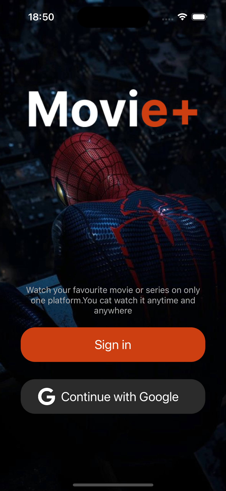

# MoviePlus
This project is an iOS application built with UIKit and SwiftUI that displays data from The Movie Database (TMDB). It includes the following features:

  User Authentication:
  - Email and Password: Users can sign in and sign up using their email and password.
  - Google Sign-In: Users can sign in using their Google account.
  - Data Display: The app fetches and displays movie data from TMDB.

  Network Services: 
  - Utilizes Alamofire for handling network requests.

  Image Display: 
  - Uses Kingfisher for efficient image downloading and caching.

  Firebase Integration:
  - Firebase Authentication: Manages user authentication.
  - Firebase Analytics: Tracks user interactions and events within the app.

## Simple Tour

## Home View

## Movie Detail View

## Login View

## Sign In View

## Sign Up View

## Profile View

## Google Sign In

## Succesfull Login Push Notification

## Search Query

## Remote Notification from Firebase

## Firebase Analytics Dashboard

